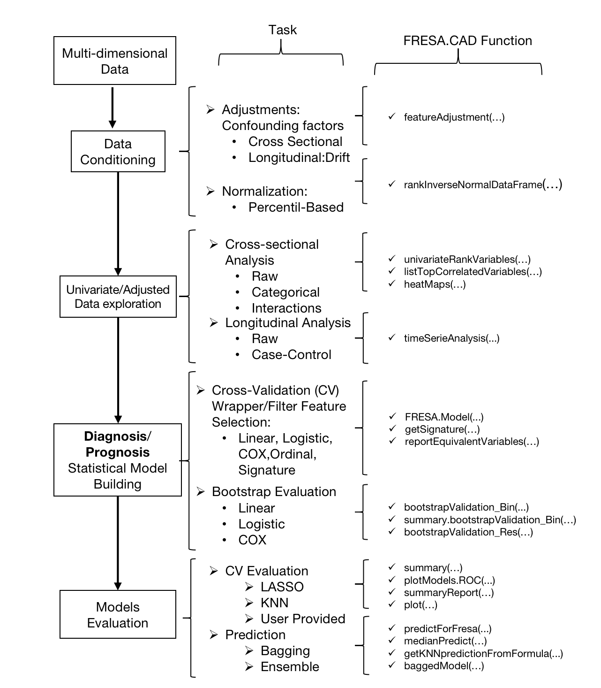
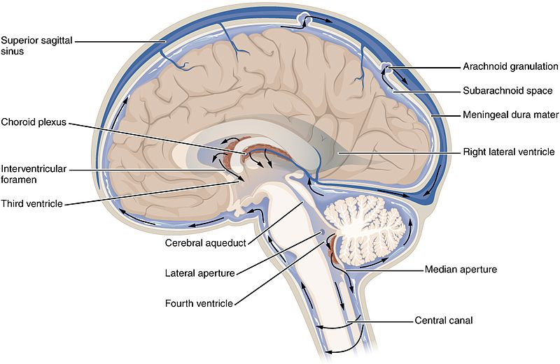
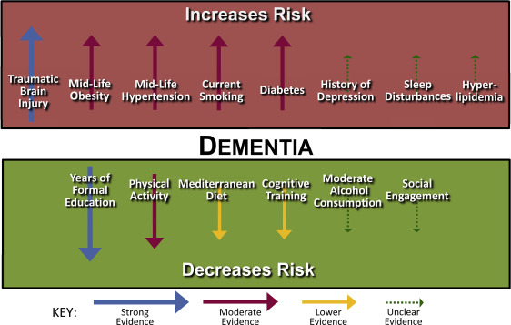
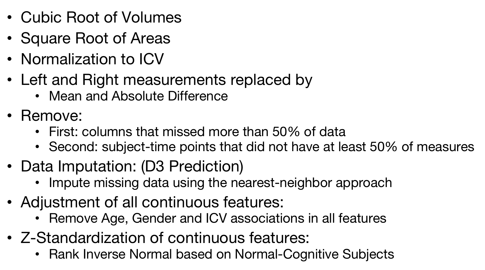
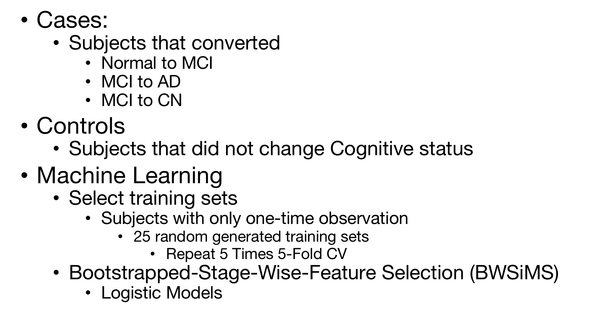
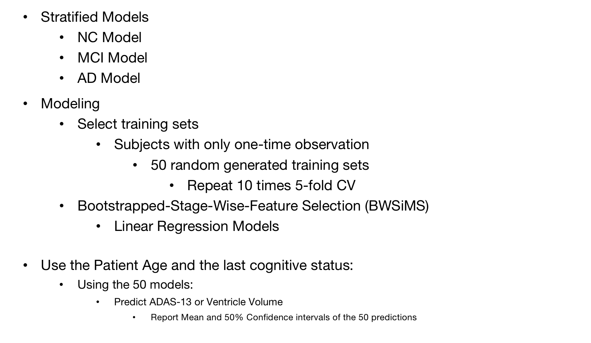
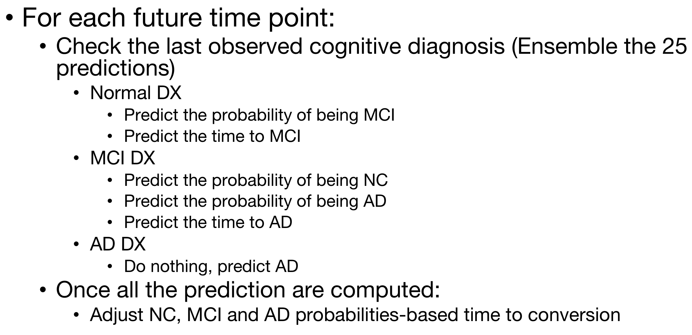
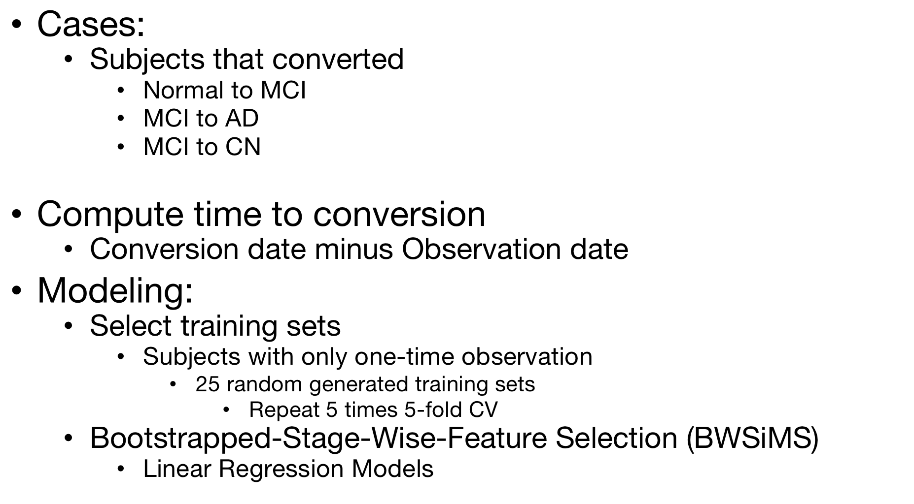

# Prediction of Longitudinal Evolution in Alzheimer’s Disease and Driving Force Analysis with Shap

####  Project Status: [Active]

## Background knowledge

No single clinical test can be used to identify Alzheimer’s disease. A comprehensive evaluation includes a complete health history, physical examination, neurological and mental status assessments, analysis of blood, and possibly magnetic or nuclear imaging exams. While this type of evaluation may provide an accurate diagnosis of probable Alzheimer’s disease, absolute confirmation requires examination of brain tissue at autopsy.

## General study goal:

+ Predict future ourcome measurements of subjects at-risk of ad enrolled in the ADNI study 

+ Use shapley value on each feature to measure the driving force of the prediction

## Detailed study design

 
     

### Data overview

Data used in the preparation were obtained from the [Alzheimer’s Disease Neuroimaging Initiative (ADNI) database](adni.loni.usc.edu). The data we used from ADNI consists of: 

 
     

1. CSF markers of amyloid-beta and tau deposition; 

2. Various imaging modalities such as magnetic resonance imaging (MRI), positron emission tomography (PET) using several tracers: Fluorodeoxyglucose (FDG, hypometabolism), AV45 (amyloid), AV1451 (tau)as well as diffusion tensor imaging (DTI); 

3. Cognitive assessments acquired in the presence of a clinical expert; 

4. Genetic information such as alipoprotein E4 (APOE4) status extractedfrom DNA samples; 

5. General demographic information： age, gender, education, etc ...

Extracted features from this data were merged together into a final spreadsheet and made available on the LONI ADNI website.

#### Detailed description 

##### Background of AD clinial identification

##### 1. Methodologies to identify AD trait

##### 1-1 Cognitive tests

Cognitive tests can help in the diagnosis of AD. In the tests, people are instructed to copy drawings similar to the one shown in the picture, remember words, read and subtract numbers. These intercalated pentagons are used in the Mini-Mental State Examination (MMSE), an extensively used cognitive test. Image source: Wikipedia

Cognitive tests are important in Alzheimer's disease because they measure cognitive decline in a direct and quantifiable manner. In the cascade of pathological events that lead to Alzheimer's disease, cognitive decline is one of the latest to become abnormal. This is because the first abnormalities are first noticed on the microscopical scale through the misfolding of a protein called Amyloid beta. These are followed by changes at larger scales: loss of the neurons' myelin sheath, neuron death, visible atrophy in MRI scans and finally cognitive decline. (Jack et al., 2013, 2010b)

These tests have several limitations: 

+ They suffer from practice effects, i.e. patients who undertake the same test several times can learn/remember how to do it, and thus score higher at a follow-up visit; this limits the usefulness of the test in assessing dementia 

+ They have floor or ceiling effects, which means that many subjects might score the highest/lowest score possible 

+ They can be biased, as they are undertaken by a human expert who might be influenced by prior knowledge of the subject's cognitive abilities.

##### 1-2 MRI(Magnetic resonance imaging (MRI) measures

 
     

With MRI, atrophy can be quantified by measuring the volume of gray matter (GM) and white matter (WM) of the brain. The GM is the brain tissue that consists of nerve cells and the WM consists of fibres connecting these nerve cells. GM can be found in the cortex of the brain and in sub-cortical areas. As a structural MRI scan shows contrast (i.e. differences in pixel intensities) between these tissues, it can be used for volume  measurement. 

Atrophy by indicated by the loss of volume in a particular brain region between two scans, one initial scan and one follow-up scan. Atrophy is caused by the death of neurons in regions affected.

TADPOLE datasets include three main types of **structural MRI markers** of atrophy: 

+ ROI (Region of interest)volumes 
+ ROI cortical thicknesses 
+ ROI surface areas, where an ROI (region of interest) is a 3D sub-region of the brain such as the inferior temporal lobe. 

These measures are computed with an image analysis software called Freesurfer using two pipelines: cross-sectional (each subject visit is independent) or longitudinal (uses information from all the visits of a subject). The longitudinal measures are more robust, but the downside is that there are more missing values in our TADPOLE spreadsheet. 

**The MRI biomarkers in TADPOLE can be found in the columns containing UCSFFSX (cross-sectional) and UCSFFSL (longitudinal).**

##### 1-3 PET measures

 
     

Positron Emission Tomography (PET) detects pairs of gamma rays emitted by a radioactive tracer, which is introduced into the body of a biologically active molecule. Three-dimensional images of tracer concentration within the body are then constructed by computer analysis. Before a PET scan, the patient is injected with a contrast agent (containing the tracer) which spreads throughout the brain and binds to abnormal proteins (amyloid and tau). This enables researchers to track the concentration of these proteins. 

PET scans can be of several types, depending on the cellular and molecular processes that are being measured:

+ **cell metabolism** using Fluorodeoxyglucose (FDG) PET: Neuronal cell metabolism refers to the the activity going on inside neuronal cells such as the processing of food and elimination of waste. Neurons that are about to die will show reduced metabolism, so FDG PET is an indicator of neurodegeneration. FDG PET can be used to measure cell metabolism.

+ **levels of abnormal proteins** such as amyloid-beta through AV45 PET. Amyloid-beta misfolding (i.e. errors in the construction of its 3D structure) is thought to be one of the causes of Alzheimer's disease. High levels of misfolded amyloid-beta in the brain are thought to eventually lead to future neurodegeneration and cognitive decline. AV45 PET can be used to measure the levels of amyloid in the brain.

+ **levels of abnormal tau proteins** through AV1451 PET: Abnormal phosphorylated tau (i.e. tau protein + a phosphorus group) that gather together in an insoluble form eventually causes damage to the neuron's cytoskeleton, causing the neuron's transport system to collapse and thus to the neuron's death.

While PET scans are non-invasive, they have some limitations. One main limitations is that the patient is exposed to ionizing radiation, which limits the number of scans they can take in a specific time interval. PET scans also have a much lower spatial resolution compared to MRI scans. One other caveat with AV1451 PET (tau imaging) is that it is a very new imaging technology and still under research, and very few subjects in the TADPOLE dataset have undertaken these images. 

**PET measures can be found in columns containing "BAIPETNMRC" (FDG PET), "UCBERKELEYAV45" (AV45) and "UCBERKELEYAV1451" (AV1451).**

##### 1-4 DTI measures

 
     

While structural MRI measures brain atrophy, MRI can also be used to measure other markers of neurodegeneration that provide complementary information for dementia diagnosis. One such marker is diffusion tensor imaging (DTI). DTI can measure the degeneration of white matter (connections between neurons) in the brain. This is done by analysing the diffusion of water molecules along the neuron fibre connections. 

Molecular diffusion in tissues is not free, but reflects interactions with many obstacles, such as macromolecules, fibers, and membranes. When a fiber connection degrades, the diffusion becomes more isotropic (i.e. equal in every direction), which can be quantified using a measure called fractional anisotropy. 

DTI measures have some limitations. In ADNI, it is a relatively recent imaging modality, and thus many subjects will not have any DTI scans. Another common problem with diffusion tensor imaging and structural MRI is the partial volume effect, which means that measures at each voxel (3D pixel) are biased due to averaging across many different cells that are contained in that voxel.

**In the TADPOLE spreadsheet, DTI measures can be found in columns containing "DTIROI".**

##### 1-5 CSF measures

 
     

The cerebrospinal fluid (CSF) is a clear, colourless body fluid found in the brain and spinal cord. It acts as a cushion or buffer for the brain, providing basic mechanical and immunological protection to the brain inside the skull. A sample of the CSF can be taken from patients invasively, by inserting a needle in the spinal cord, a procedure called lumbar puncture.

Measures of CSF are very important for dementia research. In the CSF, the concentration of **abnormal proteins** such as **amyloid-beta and tau** is a strong indicator of AD. Abnormal levels of concentrations in these proteins are some of the earliest signs of Alzheimer's disease and can indicate abnormalities many years before symptom onset.

##### 1-6 Risk factors

 
     

There are several important risk factors that are known to cause dementia. 

+ The **alipoprotein E4 variant (APOE E4)** is a gene that is the largest known risk factor for AD. Subjects with APOE E4 have a risk 10 to 30 times higher of developing AD compared to non-carriers (i.e. subjects without the gene). The exact mechanism through which the presence of APOE E4 leads to AD is not known. The presence of APOE E4 in a particular subject is denoted by a 1 in the APOE column in TADPOLE_D1_D2.csv

+ Another known and important risk factor for AD is **age** – the older subjects are the more likely they are to develop AD. Above the age of 65, the risk of developing dementia doubles every 5 years.

+ **Gender** is another known risk factor, where women seem more likely to develop AD than men. The reasons for this are still unclear.

+ **medical condition** Medical conditions such as type 2 diabetes, high blood pressure, high cholesterol, obesity or depression are known to increase the risk of developing dementia. 

+ **lifestyle** Lifestyle factors known to increase the risk of developing dementia include physical inactivity, smoking, unhealthy diet, excessive alcohol or head injuries.

**While some of these risk factors (APOE, age and gender) are found in the TADPOLE_D1_D2.csv spreadsheet, the other factors are not present.**

**The information does however exist in the ADNI database (one spreadsheet is under Study Data-> Medical History -> Medical History [ADNI1,GO,2]) and TADPOLE participants are welcome to use the information from these spreadsheets if desired.**

##### 2. Biomarkers of AD

Given the above methodplogies, the five most commonly investigated biomarkers were recently included in the revised diagnostic criteria for AD and MCI due to AD (Albert et al.,2011; McKhann et al., 2011). These five biomarkers can be divided into two categories: 

+ measures of the amyloid beta protein 

+ measures of damage to nerve cells (Jack et al., 2012).

The standard datasets contain the some or all of the following biomarkers:

##### 2-1. Main cognitive tests (excluding subtypes) - neuropsychological tests administered by a clinical expert

+ CDR Sum of Boxes
+ ADAS11 (The Alzheimer's Disease Assessment Scale)
+ ADAS13 (ADAS11 and ADAS13 reflect the 11-item and 13-item versions of this test)
+ MMSE (Mini-mental state examination)
+ RAVLT (Rey Auditory Verbal Learning Test)
+ Moca (Montreal Cognitive Assessment)
+ Ecog (ECOG Performance Status)

##### 2-2. MRI of ROIs - measures of brain structural integrity of ROI (Region of interest)

+ volumes
+ cortical thicknesses
+ surface areas

##### 2-3. FDG PET marker of ROI averages - measure cell metabolism, where cells affected by AD show reduced metabolism of ROI (Region of interest)

##### 2-4. AV45 PET marker of ROI averages - measures amyloid-beta load of ROI (Region of interest) in the brain, where amyloid-beta is a protein that mis-folds (i.e. its 3D structure is not properly constructed), which then leads to AD

##### 2-5. AV1451 PET marker of ROI averages - measures tau load in the brain, where tau is another protein which, when abnormal, damages neurons and thus leads to AD

##### 2-6. DTI of ROI measures - measures microstructural parameters related to cells and axons (cell radial diffusivity, axonal diffusivity, etc ... )

+ Mean diffusivity
+ Axial diffusivity
+ Radial diffusivity

##### 2-7. CSF biomarkers - amyloid and tau levels in the cerebrospinal fluid (CSF), as opposed to the cerebral cortex

##### 2-8. Others:

+ APOE status - a gene that is a risk factor for developing AD
+ Demographic information: age, gender, education, etc ...
+ Diagnosis: either cognitively cormal (CN), mild cognitive impairment (MCI) or Alzheimer's disease (AD).

### Model construction goal

For every individual, month-by-month forecasts of three key biomarkers: 

1. Classification model: clinical status which can be either cognitively normal (CN), mild cognitive impairment (MCI) or probable Alzheimer’s disease (AD); 

2. Regression model: ADAS-Cog13 (ADAS13) score; 

3. Regression model: ventricle volume (divided by intra-cranial volume). 

### Data Conditioning

 
     

### Modeling Conversion

 
     

### ADAS 13 and Ventricle Volume Modeling

 
     

### Cognitive Status Prediction

 
     

### Time to conversion prediction

 
     

## Needs of this project

## Getting Started

1. Clone this repo (for help see this [tutorial](https://help.github.com/articles/cloning-a-repository/)).
2. Raw Data is being kept [here](Repo folder containing raw data) within this repo.

    *If using offline data mention that and how they may obtain the data from the froup)*
    
3. Data processing/transformation scripts are being kept [here](Repo folder containing data processing scripts/notebooks)
4. etc...

*If your project is well underway and setup is fairly complicated (ie. requires installation of many packages) create another "setup.md" file and link to it here*  

5. Follow setup [instructions](Link to file)

## Featured Notebooks/Analysis/Deliverables
* [Notebook/Markdown/Slide Deck Title](link)
* [Notebook/Markdown/Slide DeckTitle](link)
* [Blog Post](link)

## Contributing DSWG Members

**Team Leads (Contacts) : [Full Name](https://github.com/[github handle])(@slackHandle)**

#### Other Members:

|Name     |  Slack Handle   | 
|---------|-----------------|
|[Full Name](https://github.com/[github handle])| @johnDoe        |
|[Full Name](https://github.com/[github handle]) |     @janeDoe    |

## Contact
* If you haven't joined the SF Brigade Slack, [you can do that here](http://c4sf.me/slack).  
* Our slack channel is `#datasci-projectname`
* Feel free to contact team leads with any questions or if you are interested in contributing!

